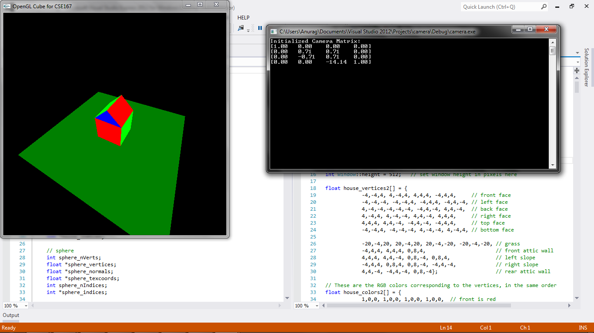

CSE 167 - Introduction to Computer Graphics
Project 2: camera
======

(See full project specifications here: http://ivl.calit2.net/wiki/index.php/Project2Fall13)

Renders a house in 2 different views by modifying camera matrix.

Renders various objects loaded from given .obj files.

Objects can also be translated, rotated, and scaled using keyboard keys as in cube.

Objects:
* F1: cube
* F2: sphere
* F3: teddy
* F4: teapot
* F5: cow
* F6: bunny
* F8: house (view1)
* F9: house (view2)

Fullscreen:
* f: toggle fullscreen

